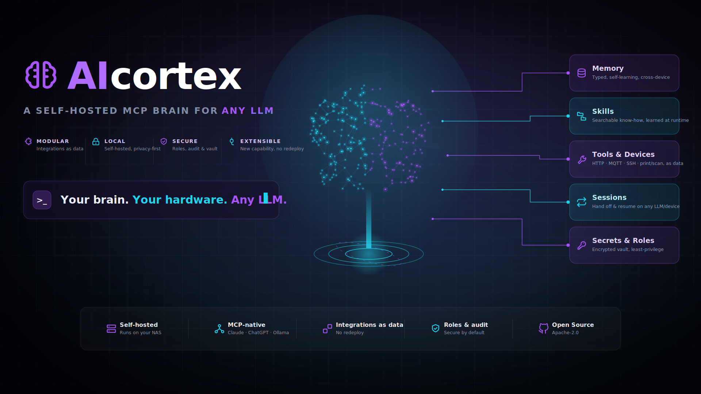

<p align="center">
  
</p>

<p align="center">
  <a href="LICENSE"></a>
  <a href="https://github.com/IkarusMK/AIcortex/releases"></a>
  <a href="https://github.com/IkarusMK/AIcortex/actions/workflows/build.yml"></a>
  
  
</p>

<p align="center"><b>A private, self-hosted brain for your LLM — on your own NAS.</b></p>

AICortex is a self-hosted [MCP](https://modelcontextprotocol.io) server that turns your NAS into a **personal LLM connector**: a persistent "brain" your assistant loads at the start of every session. Any MCP-capable LLM — Claude, ChatGPT, or a fully local model — gains a durable identity and real reach into your own services and devices, while running inside **your** network.

The model stays in its provider's cloud (or runs locally). **Your memory, skills and secrets stay on your NAS.** The assistant talks to AICortex over an HTTPS connector; the server uses your local credentials internally and never hands them to the model. New capabilities are added as **data** — a skill, a service config, a secret — with no redeploy.

## Highlights

**🧠 A brain that travels with you**
- One-call `bootstrap` onboarding — loads the guide *and* a live catalog of everything on the brain in a single round-trip
- Self-learning, **typed** memory with a review queue, so it grows without polluting itself
- A **skill router** — search your skills, load only what's needed (progressive disclosure), learn new ones at runtime
- The *same* brain on desktop **and** mobile — one account, one state

**🔌 Real reach — everything as data**
- HTTP services, **MQTT** & **FTP/FTPS** devices, **WebDAV** cloud, **SSH/SFTP**, **SMTP** email
- **IPP printing** and **eSCL scanning** (straight into Paperless-ngx) to LAN multifunction devices
- An **MCP gateway** to use other MCP servers' tools as data
- Register an integration once with one tool call — no code, no redeploy

**👥 Team & continuity**
- A **presence-aware multi-agent board**: live presence, capability-routed task *pull*, context-preserving handoff
- **Cross-LLM session handoff** — resume exactly where another model or device left off
- **Cron-as-data scheduling** with a small NAS-side runner

**🔒 Secure & self-hosted**
- Your own **OIDC** login, **roles** (admin / user / viewer) and opt-in **per-user data isolation**
- An **encrypted secret vault** and an **SSRF egress guard**; auth fails closed
- Runs end-to-end on your hardware — including with a **local model** (Ollama)

## How it works

```
LLM app — any MCP client (desktop / mobile)  ·  one or many agents
        │  custom connector / MCP server (HTTPS, from the model's cloud)
        ▼
Reverse proxy (Zoraxy / Caddy / nginx / Traefik …)
        │
        ▼
AICortex  (this container, on your NAS)
        │  uses local files & secrets
        ▼
Memory · Skills · HTTP services · MQTT & FTP devices · WebDAV cloud · Workspace files
   · SSH/SFTP · SMTP email · IPP printing · eSCL scanning · MCP gateway · Inbox/Tasks
   · Sessions · Cron · Secret vault   (every outbound call passes the SSRF egress guard)
```

## How AICortex differs

The "LLM brain" space has some great projects — AICortex deliberately sits in a different spot:

- **[GBrain](https://github.com/garrytan/gbrain)** is a *memory engine* — markdown-first, Postgres/PGLite-backed, with a self-wiring knowledge graph and hybrid/vector search. Deep retrieval, one concern.
- **[CortexPrism](https://cortexprism.io/)** is a full *agent operating system* — its own runtime, ~30 LLM providers, a plugin marketplace, sandboxed code execution and multi-user teams. Batteries included, heavyweight.
- **AICortex** is a single, lightweight *MCP connector*: one container that gives any MCP client a persistent brain — memory **and** skills, devices, sessions, secrets and scheduling — where new integrations are added as **data, no redeploy**. No database, no graph, no marketplace; you bring your own LLM client.

Rule of thumb: want a dedicated memory/graph engine → GBrain; want a batteries-included agent OS → CortexPrism; want a minimal self-hosted connector that plugs your existing LLM app into your own stuff → AICortex.

## Requirements

- A NAS or server running **Docker** (Compose v2).
- A **reverse proxy** serving the container over public HTTPS (cloud-hosted LLM clients connect from their provider's cloud, so the endpoint must be reachable from the internet; a purely local client can reach it on the LAN).
- A domain/subdomain pointing at your proxy.
- An **MCP-capable client** that supports custom connectors / MCP servers (Claude, ChatGPT, or any MCP client).

## Quick start

```bash
git clone git@github.com:IkarusMK/AICortex.git
cd AICortex
cp .env.example .env        # adjust PUID / PGID / HOST_PORT / TZ
docker compose up -d --build
```

The MCP endpoint is served at `http://<host>:8787/mcp`.

> **Prebuilt image (no local build):** a multi-arch image is published to GHCR by CI.
> In `docker-compose.yml`, comment out `build: .`, uncomment
> `image: ghcr.io/ikarusmk/aicortex:latest`, then `docker compose pull && docker compose up -d`.

**Expose it & add the connector:**

1. Point a subdomain (e.g. `agent.example.com`) at your reverse proxy.
2. Proxy that host to `http://<nas-ip>:8787` over HTTPS — the upstream is **plain HTTP**, so do *not* enable "TLS to upstream". If your proxy geo-blocks, allow your LLM provider's egress region.
3. In your MCP client: **add a custom connector / MCP server** → URL `https://agent.example.com/mcp`.
4. Test: ask the assistant to call the `ping` tool.

## Authentication & authorization

AICortex separates **authentication** (who may connect) from **authorization** (what they may do). Set up the login once, then pick your mode with a single line in `.env`.

### 1. Authenticate with your own OIDC provider

Exposing the connector publicly requires OAuth. AICortex uses **your own identity provider** as the login backend — Pocket ID, Authentik, Keycloak, Auth0, anything with standard OIDC discovery. FastMCP's OIDC proxy handles the MCP-side OAuth 2.1 flow (Dynamic Client Registration + PKCE); your provider does the actual login.

| Variable | Example |
|----------|---------|
| `OIDC_CONFIG_URL` | `https://id.example.com/.well-known/openid-configuration` |
| `OIDC_CLIENT_ID` / `OIDC_CLIENT_SECRET` | from a client you register in your provider |
| `BASE_URL` | `https://agent.example.com` (this server's public URL) |
| `JWT_SIGNING_KEY` | `openssl rand -hex 32` |

Register the OAuth client in your provider with redirect URI **`<BASE_URL>/auth/callback`**, then (re-)add the connector in your client to be sent through the login.

> ℹ️ **Don't** put reverse-proxy SSO / forward-auth in front of `/mcp` — an MCP connector is a *machine* client and can't follow an interactive login redirect. Authentication belongs at the MCP layer, which is exactly what this does. When the OIDC variables are unset, the server binds to `127.0.0.1` only (local testing).

### 2. Pick your mode — one line in `.env`

|  | 🏠 **Homelab** | 🏢 **Enterprise** |
|---|---|---|
| **For** | one trusted person (you) | several people on one brain |
| **Tool access** | everyone gets every tool | roles: admin / user / viewer |
| **Data** | one shared brain | per-user memory **+ private vault** |
| **The line** | `AUTH_ENFORCE=0` | `AUTH_ENFORCE=1` *(default)* |

**🏠 Homelab — keep it simple**
```env
AUTH_ENFORCE=0
```
Every authenticated caller gets every tool — one shared brain, zero friction. Authentication (OIDC) still guards the front door; you've just turned off the *internal* role gate.

**🏢 Enterprise — several people, one brain**
```env
AUTH_ENFORCE=1                          # default — roles on (admin / user / viewer)
TENANCY_ISOLATE=1                       # each non-admin gets their own memory + vault
OIDC_SCOPE=openid profile email groups  # request the groups claim
AUTH_ROLE_CLAIM=groups                  # map Pocket ID groups → roles
```
Roles are driven by your IdP groups (mapped in `data/auth/policy.json`, or managed live with the `tenancy_*` admin tools). Each non-admin is confined to their **own memory scope and private vault namespace** — two people never read or overwrite each other's data — while an admin provisions per-user secrets (`secret_set owner=…`). Admins keep full access.

Both modes run the same image. Isolation is **opt-in and fails open**, so flipping it on never strands the operator. **Full guide: [docs/authorization.md](docs/authorization.md).**

## Capabilities

| Group | Tools | What it does |
|-------|-------|--------------|
| Onboarding | `bootstrap` | **Start here** — one call returns the guide + a live catalog of the whole brain |
| Health | `ping` | Connectivity check |
| Memory | `memory_write` (typed) · `memory_read`/`list`/`search`/`delete` · `memory_note` · `memory_candidates` · `memory_promote`/`memory_reject` | Self-learning, **typed** facts with dedup + a candidate review queue |
| Skills | `skill_search` · `skill_list` · `skill_load` · `skill_resource` · `skill_write` | Searchable know-how; learn new skills at runtime |
| Services (HTTP) | `service_add` · `service_list` · `call_service` | Register & call any HTTP API as data |
| Devices (MQTT) | `mqtt_add` · `mqtt_list` · `mqtt_publish` · `mqtt_get` | Talk to MQTT devices (e.g. a LAN printer or sensor) as data |
| Files (FTP/FTPS) | `ftp_add` · `ftp_list_endpoints` · `ftp_list` · `ftp_upload` | Up/list files over FTP/FTPS |
| Cloud (WebDAV) | `webdav_add` · `webdav_list` · `webdav_upload` · `webdav_download` · `webdav_mkdir` · `webdav_delete` | Move large files NAS↔cloud (Nextcloud/ownCloud), app-password auth |
| Workspace files | `fs_list` · `fs_read` · `fs_write` · `fs_move` · `fs_delete` · `fs_info` | See & tidy the `/data/work` file hub (sandboxed) |
| SSH / SFTP | `ssh_add` · `ssh_run` · `ssh_upload` · `ssh_download` · `ssh_list_dir` | Run remote commands & transfer files (hosts as data, vault creds) |
| Email (SMTP) | `mail_add` · `mail_list` · `mail_send` | Send mail/notifications with optional attachment |
| Printing (IPP) | `print_add` · `print_list` · `print_delete` · `print_document` | Print PDFs/images to a LAN printer via IPP/AirPrint |
| Scanning (eSCL) | `scan_add` · `scan_list` · `scan_delete` · `scan_document` | Scan on a LAN device → `/data/work`, optionally into Paperless |
| MCP gateway | `mcp_add` · `mcp_list` · `mcp_tools` · `mcp_call` | Use other MCP servers' tools as data |
| Multi-agent | `agent_register`/`list` · `task_add`/`list`/`claim`/`update` · `task_next` · `task_handoff` · `inbox_*` | Presence-aware team: capability-routed pull & context-preserving handoff |
| Sessions | `session_save` · `session_list` · `session_load` · `session_delete` · `session_prune` | Cross-LLM handoff log; auto-expires |
| Scheduling | `cron_add` · `cron_list` · `cron_delete` · `cron_due` · `cron_mark_run` | Cron jobs as data; a NAS runner triggers them |
| Secrets | `secret_set` · `secret_list` · `secret_delete` | Encrypted vault; values never returned |
| Tenancy (admin) | `tenancy_set` · `tenancy_show` · `tenancy_list` · `tenancy_unset` · `tenancy_status` | Configure per-user data areas — the multi-user control plane, as data |
| Guide | `guide` | Self-description (also sent as server `instructions` on connect) |

Every register has a matching delete (`skill_delete`, `service_delete`, `mqtt_delete`, `memory_delete`, `secret_delete`, …), so anything you register you can also remove via the connector.

## Memory, skills & the skill router

This is the heart of the project — making the assistant *itself* portable, not just the chat.

- **Memory** lives as plain files under `data/memory`; the `memory_*` tools let the LLM recall and update what it knows about you, the same on every device.
- **Skills** live as folders under `data/skills` (`<skill>/SKILL.md` + resources). The router (`skill_search` / `skill_load` / `skill_resource`) finds the right skill and pulls in **only what it needs** (progressive disclosure).
- **Categories keep it cheap — and are mandatory.** `skill_write` refuses an uncategorized skill and snaps near-duplicate spellings onto the existing category, so a 300-skill library stays a dozen lines in `bootstrap`, not a token dump. Starter skills live in [`examples/skills/`](examples/skills/README.md).
- **Call `bootstrap` first.** Its description tells any LLM to call it at the start of every session. For clients that don't call tools on their own, add a one-line instruction to your client's project/system prompt — see [`docs/client-project-instructions.md`](docs/client-project-instructions.md).

## Auto-memory — a brain that learns by itself

Most assistants forget the moment a chat ends. AICortex closes that loop — and stays tidy while doing it.

- **Typed, on purpose.** Every memory is `user`, `feedback`, `project` or `reference`; `memory_write` refuses an untyped memory, so the brain stays sorted by intent.
- **Learns in-session, at zero extra cost.** The model already talking to you distills the durable facts and writes them back — no second model, no background loop.
- **Dedup-first.** A write flags overlapping entries so related facts merge into one file instead of multiplying.
- **A review queue.** Anything captured automatically (or staged with `memory_note`) lands as a **candidate**, not live memory — you `memory_promote` the keepers and `memory_reject` the rest. Set `LEARN_AUTOCAPTURE=0` to turn auto-capture off.

## Tools & integrations (as data)

New integrations don't need new code. A **service** is a small config you register at runtime with `service_add` (stored under `data/services`); `call_service` then reaches it — only registered services are allowed, and the auth token is injected server-side from the vault (`token_env`), never stored in service data or returned to the model. Pair a service with a `skill_write` skill that explains how to use it, and a new capability is live **without a redeploy**.

## Multi-agent — one brain, many agents

Run your assistants as a **team**: Claude on the desktop, a local model on the NAS, your phone — sharing one brain and one task board.

- **Live presence.** `agent_register` doubles as a heartbeat; `agent_list` shows who's online / idle / away, and `bootstrap` surfaces the team at the top.
- **Pull work, don't hunt for it.** `task_next(owner)` recommends the best open task (assigned-to-you → capability match → unassigned); `task_claim` takes it.
- **Hand off with full context.** `task_handoff(id, to)` reassigns a task, notifies the recipient, and attaches the work session — they `session_load` and pick up exactly where the other stopped.
- **Namespaced memory.** Shared knowledge in `shared`, private notes in `agents/<name>`.

Sub-agent *spawning* stays client-side; the connector is the shared coordination layer they meet on. See [`docs/ARCHITECTURE.md`](docs/ARCHITECTURE.md).

## Autonomy & scheduling

Schedules live on the NAS as **data** — `cron_add(name, schedule, prompt)` from any device; `cron_list` / `cron_delete` manage them. What the connector **can't** do is run the model itself, so the autonomy *engine* is a small **NAS-side runner**:

1. System cron runs a recurring agent invocation (e.g. `claude -p`, or any LLM CLI/SDK).
2. It calls `cron_due` → executes each due job's prompt **through this connector** → `cron_mark_run`.
3. It reports the result via your configured channel, or posts to the connector **inbox**.

Two ready-to-deploy runners live in [`runner/`](runner/README.md): a **Claude Code backend** (does the connector's OAuth login itself) and a **generic any-LLM backend** ([`runner/generic/`](runner/generic/README.md)) that drives the connector from any model via [LiteLLM](https://github.com/BerriAI/litellm), authenticating with a static `RUNNER_TOKEN` accepted alongside OIDC (FastMCP `MultiAuth`).

## Run it with a local model (Ollama)

AICortex is model-agnostic — including **fully local** models. Point [Open WebUI](https://github.com/open-webui/open-webui) at the connector over its native MCP transport and a local [Ollama](https://ollama.com) model gets the same memory, skills and tools as any cloud assistant — nothing leaves your network. Tool-calling quality depends on the local model you pick. **Full guide: [docs/local-llm-openwebui.md](docs/local-llm-openwebui.md).**

## Security

- **Auth fails closed.** Without OIDC the server binds to `127.0.0.1` only (override with `ALLOW_INSECURE=1`). Enable OIDC **before** exposing the proxy — anyone who reaches `/mcp` can otherwise call every tool.
- **SSRF guard.** `service_add` / `mqtt_add` / `ftp_add` are model-callable, so the registered-target list isn't a trust boundary by itself. Every outbound host is resolved and **private / loopback / link-local / cloud-metadata addresses are blocked** unless they fall inside `INTERNAL_ALLOW_CIDRS` (operator-only). Set it to the LAN/VPN ranges you actually use.
- **Encrypted vault, enforced.** Secrets go in the vault via `secret_set` (encrypted at rest, referenced by name, never returned). `secret_set` **refuses plaintext** unless `STORAGE_ENCRYPTION_KEY` is set. `.env` is only for bootstrap config.
- **TLS verified by default** for FTP / MQTT / WebDAV / scanning; self-signed LAN devices opt out per-endpoint via the admin-only registration tools (`tls_insecure` / `ca_bundle`).
- `.env` and `data/` contents are git-ignored — never commit secrets.

AICortex has been through external security review (fail-closed vault, SSH host-key pinning, connect-time DNS-rebinding protection, resource limits, the authorization layer and per-user isolation). **Full status & reporting: [SECURITY.md](SECURITY.md).**

## Configuration

All config lives in `.env` (copy from `.env.example`):

| Variable    | Default | Description |
|-------------|---------|-------------|
| `HOST_PORT` | `8787`  | Host port the server is published on (the container always listens on `8787` internally) |
| `PUID` / `PGID` | `1000` | User/group ID the process runs as (file ownership) |
| `TZ`        | `UTC`   | Container timezone |

OIDC, authorization and hardening variables are documented inline in [`.env.example`](.env.example) and the [Authentication & authorization](#authentication--authorization) section.

## Deploying on a VPS or over a VPN

The connector is just an HTTPS MCP endpoint, so it runs anywhere Docker does. The SSRF guard keeps that safe:

- **VPS, public APIs only:** same reverse proxy + OIDC, set `BASE_URL` to its public URL, leave `INTERNAL_ALLOW_CIDRS` **empty**.
- **Reach home devices from a VPS:** link the VPS and your LAN with a VPN (WireGuard, Tailscale, …) and add the **VPN/remote subnet** to `INTERNAL_ALLOW_CIDRS` (e.g. `100.64.0.0/10` for Tailscale).
- **Multi-site:** scope `FORWARDED_ALLOW_IPS` to the proxy, list only trusted subnets in `INTERNAL_ALLOW_CIDRS`, and use a dedicated OIDC client.

## Project structure

```
AICortex/
├── app/                # Server code (FastMCP) — one module per tool group
│   ├── server.py       #   entrypoint — wires auth + registers tool modules
│   ├── memory.py · skills.py · services.py · mqtt_tools.py · ftp_tools.py
│   ├── webdav_tools.py · fs_tools.py · ssh_tools.py · mail_tools.py
│   ├── print_tools.py · scan_tools.py · mcp_gateway.py · coordination.py
│   ├── cron.py · sessions.py · secrets_store.py · bootstrap.py · guide.py
│   ├── authz.py · tenancy.py · pocketid_proxy.py · netguard.py · learn.py
│   └── requirements.txt
├── data/               # Persistent, human-readable state (git-ignored content)
│   ├── memory/ · skills/ · services/ · mqtt/ · ftp/ · webdav/ · ssh/ · mail/
│   ├── coordination/ · cron/ · sessions/ · printers/ · scanners/
│   ├── vault/          #   encrypted secrets
│   ├── auth/           #   OAuth client registrations + policy.json
│   └── work/           #   workspace file hub (scans, downloads, fs_*)
├── docs/               # Architecture, authorization, local-LLM & client guides
├── runner/             # Reference NAS-side autonomy runners
├── Dockerfile · entrypoint.sh · docker-compose.yml · .env.example
```

> Dependencies are baked **into the image** at build time — no install-on-start volume. `data/`, `logs/` and `secrets/` keep their structure via `.gitkeep`; their *contents* are git-ignored.

## Troubleshooting

### See what's wrong first

A handful of **read-only** commands surface almost everything. Replace the placeholders (`<compose-dir>`, `<device-ip>`) with your own values.

```bash
# 1) Container logs — startup banner + live errors
docker logs --tail 50 aicortex

# 2) Verbose auth logging (then re-read the logs)
#    docker-compose.yml → environment:   FASTMCP_LOG_LEVEL: "DEBUG"

# 3) Which version / feature is actually running in the container?
docker exec aicortex python -c "import netguard; print('has tls_verify:', hasattr(netguard,'tls_verify'))"

# 4) Authorization decisions — who called what, allow/deny (per-person 'sub')
tail -n 20 <compose-dir>/data/auth/audit.log        # set AUTH_AUDIT_ALL=1 to log allowed calls too

# 5) Can the container actually reach a device? (verify off = ignore self-signed)
docker exec aicortex python -c "import httpx; print(httpx.get('https://<device-ip>/', verify=False, timeout=5).status_code)"
```

> **After pulling a new image, restart your LLM client session** — don't just "refresh tools". MCP clients freeze the tool list at connect, so new tools/parameters only appear on a fresh session. If a new parameter still doesn't show after `docker compose pull && up -d --force-recreate`, confirm the container is really on the new image with command #3 above.

### Common issues & fixes

| Symptom | Cause & fix |
|---------|-------------|
| Login succeeds, client says *"returned an error when connecting"*; logs show **`Token missing required scopes`** | The proxy-issued token doesn't carry upstream scopes as claims. **Don't set `required_scopes`** — a successful login is enough (already handled in `server.py`). |
| `Issued new FastMCP tokens` then **`Bearer token rejected`** (401) | Behind a TLS-terminating proxy, uvicorn ignored `X-Forwarded-Proto`. Set **`FORWARDED_ALLOW_IPS: "*"`** (already in `docker-compose.yml`). |
| **`disk client_storage unavailable (Fernet key must be 32 url-safe base64-encoded bytes)`** | `STORAGE_ENCRYPTION_KEY` isn't a valid Fernet key (it's **not** `JWT_SIGNING_KEY`). Generate: `python -c "from cryptography.fernet import Fernet;print(Fernet.generate_key().decode())"`. |
| `Bearer token rejected` for an **old client id** after recreating the container | The OAuth client store was ephemeral. Persistent `data/auth` fixes it; to clear a stuck client, remove the connector, fully quit & reopen the app, re-add. |
| Connector won't connect; proxy returns a login **web page** | Reverse-proxy SSO / forward-auth in front of `/mcp`. A machine client can't do interactive login — **remove it**; auth belongs at the MCP layer. |
| IdP consent button spins forever; browser console shows `null is not an object (… scope.includes)` | The upstream `/authorize` carried **no `scope`** (some IdP UIs crash on `scope=null`). Already sent via `extra_authorize_params`; override with `OIDC_SCOPE`. |
| `call_service` / `mqtt` / `ftp` to a **local device** returns *"Blocked by network policy"* | The SSRF guard blocks private IPs by default. Add the device's range to **`INTERNAL_ALLOW_CIDRS`** and restart. |
| **Scan / WebDAV fails or falls back to plain HTTP** (e.g. *"did not start a job … 404"*) | The LAN device serves HTTPS with a **self-signed certificate**, which is verified by default. Confirm with `curl -k https://<device-ip>/...` → if that returns `200`, register it self-signed: `scan_add`/`webdav_add` with **`tls_insecure=true`** (or point `ca_bundle` at its cert). |
| **A new tool or parameter from an update doesn't appear** | Your LLM client cached the old tool schema. **Fully restart the client session** (re-adding the connector is often not enough). |
| **Pulled a new image but old behaviour persists** | The container didn't recreate (or `latest` wasn't rebuilt yet). Run `docker compose pull && docker compose up -d --force-recreate`, then verify with diagnostic #3 above. |

## License

[Apache License 2.0](LICENSE) © 2026 IkarusMK
